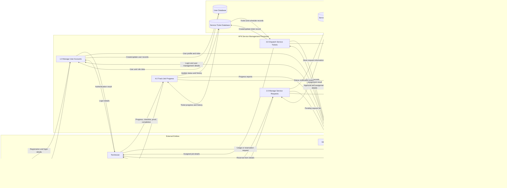

## Data Flow Diagram (DFD)

```mermaid
flowchart LR
    subgraph External_Entities[External Entities]
        Client[Client / Customer]
        Technician[Technician]
        Admin[Admin / Superadmin]
    end

    subgraph Processes[AFN Service Management Processes]
        P1[1.0 Manage User Accounts]
        P2[2.0 Manage Service Requests]
        P3[3.0 Dispatch Service Tickets]
        P4[4.0 Track Job Progress]
        P5[5.0 Manage Inventory]
        P6[6.0 Send Notifications]
    end

    subgraph Data_Stores[Data Stores]
        D1[(User Database)]
        D2[(Service Request Database)]
        D3[(Service Ticket Database)]
        D4[(Inventory Database)]
        D5[(Notification Database)]
    end

    Client -->|Registration and login details| P1
    Technician -->|Login details| P1
    Admin -->|Login and user management details| P1
    P1 -->|Authentication result| Client
    P1 -->|Authentication result| Technician
    P1 -->|User profile and roles| Admin
    P1 -->|Create/update user records| D1
    D1 -->|User and role data| P1

    Client -->|Request details, schedule, location| P2
    P2 -->|Store request information| D2
    D2 -->|Request records| P2
    P2 -->|Request status| Client
    P2 -->|Pending request list| Admin

    Admin -->|Approval and assignment details| P3
    P3 -->|Create/update ticket record| D3
    D3 -->|Ticket and schedule records| P3
    P3 -->|Assigned job details| Technician
    P3 -->|Assignment result| Admin

    Technician -->|Progress, checklist, proof, completion| P4
    P4 -->|Update status and history| D3
    D3 -->|Ticket progress and history| P4
    P4 -->|Progress updates| Client
    P4 -->|Progress reports| Admin

    Admin -->|Stock updates and adjustments| P5
    Technician -->|Usage or reservation request| P5
    P5 -->|Create/update inventory records| D4
    D4 -->|Stock, reservation, and transaction records| P5
    P5 -->|Availability and low-stock status| Admin
    P5 -->|Reserved item details| Technician

    P2 -->|Request notification event| P6
    P3 -->|Assignment notification event| P6
    P4 -->|Status notification event| P6
    P5 -->|Inventory notification event| P6
    P6 -->|Store notification record| D5
    D5 -->|Notification records| P6
    P6 -->|Notifications and messages| Client
    P6 -->|Notifications and messages| Technician
    P6 -->|Alerts and reports| Admin
```
