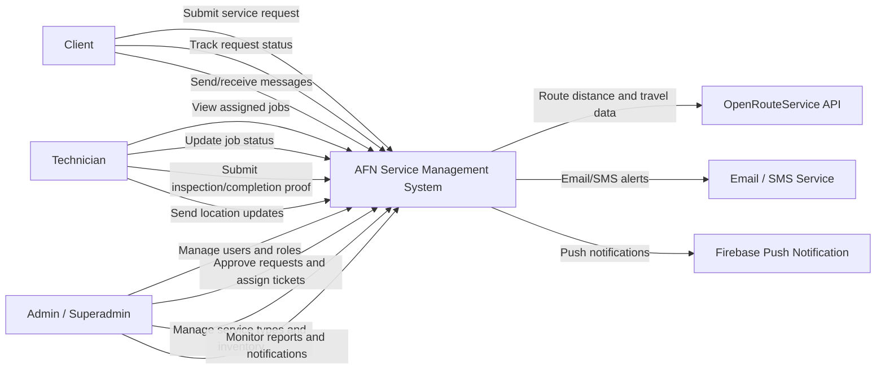
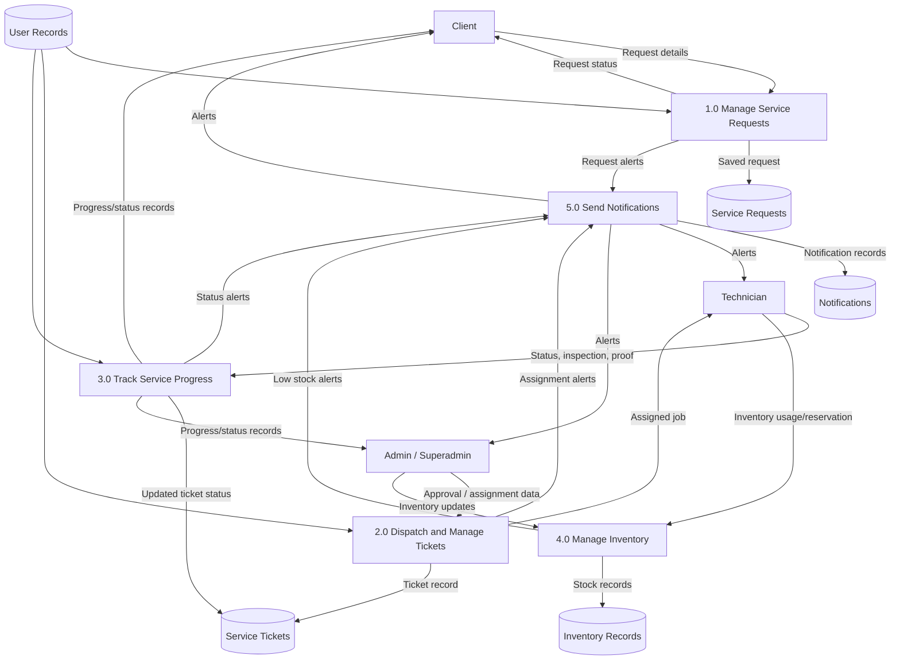

# Requirement Modeling

Project: AFN Service Management  
Prepared for: Capstone documentation

## 1. Context Diagram

The context diagram shows the AFN Service Management system as one central system interacting with external users and services.



## 2. Data Flow Diagram

### Level 0 DFD

This diagram shows the main data movement between users, system processes, and storage.



### Main Service Workflow

```mermaid
flowchart LR
    A[Client submits service request]
    B[System stores request and location]
    C[Admin approves request]
    D[System creates service ticket]
    E[Admin or auto-dispatch assigns technician]
    F[Technician starts work]
    G[Technician submits inspection and proof]
    H[Ticket is completed]
    I[After-sales, warranty, or maintenance records are created when needed]
    J[Client or admin creates a new request or ticket when another visit is needed]

    A --> B --> C --> D --> E --> F --> G --> H --> I --> J
    J -. service lifecycle continues .-> A
```



The workflow is intentionally semi-automated after completion. The system can create follow-up cases, warranty handoffs, maintenance schedules, and notifications from completed tickets and checklist data. It does not automatically create a new `ServiceRequest` for every follow-up or maintenance record; the next request or ticket is created through the normal user or administrator workflow when another service visit is needed.

## 3. Entity Relationship Diagram

The ERD is maintained as DBML so it can be imported into dbdiagram.io and exported as an image for the final paper.

Main capstone ERD:

```text
docs/DB_DIAGRAM_CAPSTONE.dbml
```

Full documentation ERD:

```text
docs/DB_DIAGRAM.dbml
```

The capstone ERD focuses on the core operational entities:

| Entity | Purpose |
| --- | --- |
| `users_user` | Stores all system accounts |
| `users_technicianprofile` | Stores technician availability and location data |
| `users_clientprofile` | Stores client-specific profile data |
| `services_servicetype` | Stores the available services |
| `services_servicerequest` | Stores client-submitted service requests |
| `services_servicelocation` | Stores address and coordinates for service requests |
| `services_serviceticket` | Stores work orders and dispatch details |
| `services_technicianskill` | Matches technicians to service types |
| `services_ticketcrewassignment` | Stores extra crew members for tickets |
| `services_servicestatushistory` | Stores ticket status changes |
| `services_inspectionchecklist` | Stores inspection and completion handoff data |
| `inventory_inventoryitem` | Stores inventory items |
| `inventory_inventoryreservation` | Stores reserved items for scheduled work |
| `notifications_notification` | Stores user notifications |

## 4. Database Structure And Dictionary

This section defines the main tables, important fields, data types, and purpose.

### `users_user`

Stores the main account data for clients, technicians, admins, and superadmins.

| Field | Type | Key | Description |
| --- | --- | --- | --- |
| `id` | integer | PK | Unique user identifier |
| `username` | varchar |  | Login username |
| `email` | varchar |  | User email address |
| `first_name` | varchar |  | User first name |
| `last_name` | varchar |  | User last name |
| `role` | varchar |  | User role: superadmin, admin, technician, or client |
| `phone` | varchar |  | Contact number |
| `address` | text |  | User address |
| `status` | varchar |  | Account status |
| `created_at` | datetime |  | Date/time created |
| `updated_at` | datetime |  | Date/time updated |

### `users_technicianprofile`

Stores technician-specific operational information.

| Field | Type | Key | Description |
| --- | --- | --- | --- |
| `id` | integer | PK | Unique technician profile identifier |
| `user_id` | integer | FK, Unique | Linked user account |
| `current_latitude` | decimal |  | Current technician latitude |
| `current_longitude` | decimal |  | Current technician longitude |
| `is_available` | boolean |  | Technician availability |
| `skill_level` | varchar |  | General skill level |
| `max_daily_assignments` | integer |  | Maximum daily tickets |
| `updated_at` | datetime |  | Date/time updated |

### `users_clientprofile`

Stores extra client information.

| Field | Type | Key | Description |
| --- | --- | --- | --- |
| `id` | integer | PK | Unique client profile identifier |
| `user_id` | integer | FK, Unique | Linked user account |
| `client_type` | varchar |  | Individual, business, or corporate |
| `company_name` | varchar |  | Company name if applicable |
| `preferred_contact_method` | varchar |  | Preferred contact method |
| `billing_address` | text |  | Billing address |
| `updated_at` | datetime |  | Date/time updated |

### `services_servicetype`

Stores service categories offered by the business.

| Field | Type | Key | Description |
| --- | --- | --- | --- |
| `id` | integer | PK | Unique service type identifier |
| `name` | varchar |  | Service name |
| `description` | text |  | Service description |
| `estimated_duration` | integer |  | Estimated duration in minutes |
| `estimated_cost` | decimal |  | Estimated service cost |
| `max_daily_assignments` | integer |  | Assignment limit per technician |

### `services_servicerequest`

Stores service requests submitted by clients.

| Field | Type | Key | Description |
| --- | --- | --- | --- |
| `id` | integer | PK | Unique request identifier |
| `client_id` | integer | FK | Client who submitted the request |
| `service_type_id` | integer | FK | Requested service type |
| `description` | text |  | Request details |
| `priority` | varchar |  | Request priority |
| `status` | varchar |  | Request status |
| `preferred_date` | date |  | Preferred service date |
| `preferred_time_slot` | varchar |  | Preferred time slot |
| `request_date` | datetime |  | Date/time submitted |
| `auto_ticket_created` | boolean |  | Indicates whether ticket was generated |

### `services_servicelocation`

Stores the location of the requested service.

| Field | Type | Key | Description |
| --- | --- | --- | --- |
| `id` | integer | PK | Unique location identifier |
| `request_id` | integer | FK, Unique | Linked service request |
| `address` | text |  | Service address |
| `city` | varchar |  | City |
| `province` | varchar |  | Province |
| `latitude` | decimal |  | Service latitude |
| `longitude` | decimal |  | Service longitude |

### `services_serviceticket`

Stores the main work order and dispatch record.

| Field | Type | Key | Description |
| --- | --- | --- | --- |
| `id` | integer | PK | Unique ticket identifier |
| `request_id` | integer | FK | Linked service request |
| `technician_id` | integer | FK | Assigned technician |
| `supervisor_id` | integer | FK | Admin/superadmin overseeing the ticket |
| `scheduled_date` | date |  | Scheduled service date |
| `scheduled_time` | time |  | Scheduled service time |
| `status` | varchar |  | Ticket status |
| `priority` | varchar |  | Ticket priority |
| `auto_assigned` | boolean |  | Whether assignment came from auto-dispatch |
| `assigned_at` | datetime |  | Assignment date/time |
| `start_time` | datetime |  | Work start time |
| `end_time` | datetime |  | Work end time |
| `completed_date` | datetime |  | Completion date/time |
| `client_rating` | integer |  | Client rating after service |
| `created_at` | datetime |  | Date/time created |
| `updated_at` | datetime |  | Date/time updated |

### `services_technicianskill`

Stores the services each technician can perform.

| Field | Type | Key | Description |
| --- | --- | --- | --- |
| `id` | integer | PK | Unique skill record identifier |
| `technician_id` | integer | FK | Technician user |
| `service_type_id` | integer | FK | Service type |
| `skill_level` | varchar |  | Skill level for the service |

### `services_ticketcrewassignment`

Stores additional technicians assigned to a ticket.

| Field | Type | Key | Description |
| --- | --- | --- | --- |
| `id` | integer | PK | Unique crew assignment identifier |
| `ticket_id` | integer | FK | Linked service ticket |
| `technician_id` | integer | FK | Crew technician |
| `created_at` | datetime |  | Date/time assigned |

### `services_servicestatushistory`

Stores the status timeline of each ticket.

| Field | Type | Key | Description |
| --- | --- | --- | --- |
| `id` | integer | PK | Unique history identifier |
| `ticket_id` | integer | FK | Linked service ticket |
| `status` | varchar |  | Status value |
| `changed_by_id` | integer | FK | User who changed the status |
| `notes` | text |  | Optional notes |
| `timestamp` | datetime |  | Date/time of change |

### `services_inspectionchecklist`

Stores inspection and completion handoff details.

| Field | Type | Key | Description |
| --- | --- | --- | --- |
| `id` | integer | PK | Unique checklist identifier |
| `ticket_id` | integer | FK, Unique | Linked service ticket |
| `created_at` | datetime |  | Date/time created |
| `completed_at` | datetime |  | Date/time completed |
| `is_completed` | boolean |  | Checklist completion status |
| `recommendation` | varchar |  | Inspection recommendation |
| `maintenance_required` | boolean |  | Whether maintenance follow-up is required |
| `maintenance_profile` | varchar |  | Maintenance profile type |
| `follow_up_required` | boolean |  | Whether follow-up is required |
| `follow_up_case_type` | varchar |  | Type of follow-up case |

### `inventory_inventoryitem`

Stores inventory records for items used in service operations.

| Field | Type | Key | Description |
| --- | --- | --- | --- |
| `id` | integer | PK | Unique inventory item identifier |
| `name` | varchar |  | Item name |
| `sku` | varchar | Unique | Stock keeping unit |
| `category_id` | integer | FK | Inventory category |
| `item_type` | varchar |  | Equipment, part, tool, consumable, or other |
| `quantity` | integer |  | Total quantity |
| `minimum_stock` | integer |  | Minimum stock threshold |
| `reserved_quantity` | integer |  | Quantity reserved for jobs |
| `status` | varchar |  | Item status |
| `unit_price` | decimal |  | Unit price |
| `total_value` | decimal |  | Total inventory value |
| `updated_at` | datetime |  | Date/time updated |

### `inventory_inventoryreservation`

Stores inventory reservations for scheduled work.

| Field | Type | Key | Description |
| --- | --- | --- | --- |
| `id` | integer | PK | Unique reservation identifier |
| `item_id` | integer | FK | Reserved inventory item |
| `technician_id` | integer | FK | Technician assigned to use the item |
| `quantity` | integer |  | Reserved quantity |
| `required_date` | date |  | Date the item is needed |
| `service_ticket_id` | integer | FK | Linked service ticket |
| `status` | varchar |  | Reservation status |
| `created_at` | datetime |  | Date/time created |

### `notifications_notification`

Stores notifications sent to users.

| Field | Type | Key | Description |
| --- | --- | --- | --- |
| `id` | integer | PK | Unique notification identifier |
| `user_id` | integer | FK | Notification recipient |
| `ticket_id` | integer | FK | Related service ticket |
| `request_id` | integer | FK | Related service request |
| `message` | text |  | Notification message |
| `type` | varchar |  | Notification type |
| `status` | varchar |  | Read/unread status |
| `created_at` | datetime |  | Date/time created |
| `read_at` | datetime |  | Date/time read |

## Documentation Note

The diagrams and dictionary above focus on the logical database design of the system. Framework tables, authentication support tables, and some background reporting tables are omitted from the main capstone diagrams to keep the documentation readable and focused on the core service management workflow.
