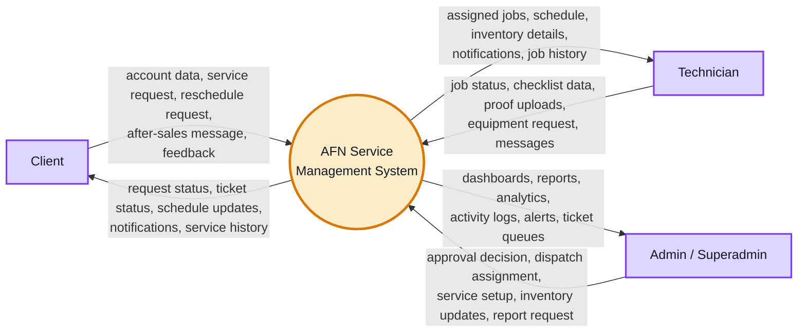
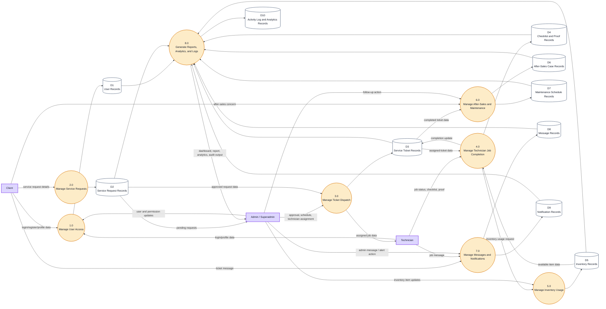
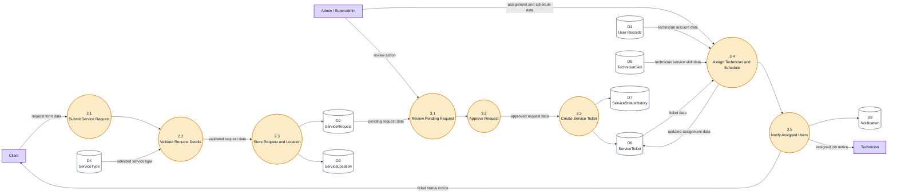
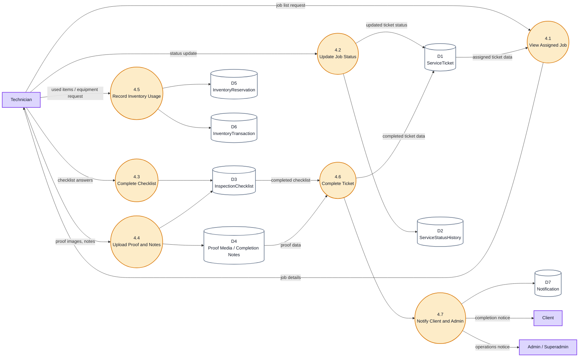
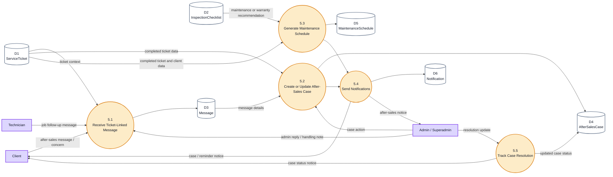
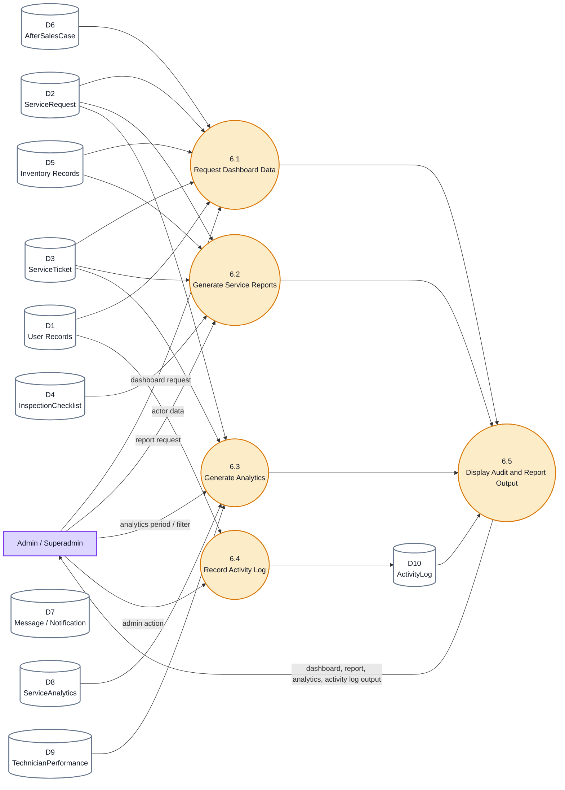

# Real Data Flow Diagram Set

This is the detailed DFD set for the AFN Service Management System based on the actual codebase. Use this when you need the "real" version instead of a simplified single-page DFD.

## Why This Is A Set

A real DFD for this system should not be forced into one diagram because the codebase has multiple connected modules:

- authentication and role access
- client service requests
- service ticket approval and dispatch
- technician job workflow
- checklist and proof upload
- inventory reservations and usage
- after-sales cases
- maintenance schedules
- messages and notifications
- reports, analytics, and activity logs

For a clean capstone document, use:

1. Context Diagram
2. Level 1 DFD
3. Level 2 DFD - Service Request and Ticket Dispatch
4. Level 2 DFD - Technician Job Completion
5. Level 2 DFD - After-Sales, Messages, and Maintenance
6. Level 2 DFD - Reports, Analytics, and Activity Logs

## Figure Captions

- **Figure X. Context Diagram of the Proposed AFN Service Management System**
- **Figure X. Level 1 Data Flow Diagram of the Proposed AFN Service Management System**
- **Figure X. Level 2 Data Flow Diagram for Service Request and Ticket Dispatch**
- **Figure X. Level 2 Data Flow Diagram for Technician Job Completion**
- **Figure X. Level 2 Data Flow Diagram for After-Sales, Messages, and Maintenance**
- **Figure X. Level 2 Data Flow Diagram for Reports, Analytics, and Activity Logs**

---

# 1. Context Diagram

Use this as the highest-level DFD.

---

# 2. Level 1 DFD

This is the complete high-level data flow.

---

# 3. Level 2 DFD - Service Request and Ticket Dispatch

This expands the actual request-to-ticket flow.

---

# 4. Level 2 DFD - Technician Job Completion

This expands the technician workflow from assigned job to completion.

---

# 5. Level 2 DFD - After-Sales, Messages, and Maintenance

This expands what happens after a ticket is completed or when the client sends a ticket-related concern.

---

# 6. Level 2 DFD - Reports, Analytics, and Activity Logs

This expands the admin monitoring flow.

