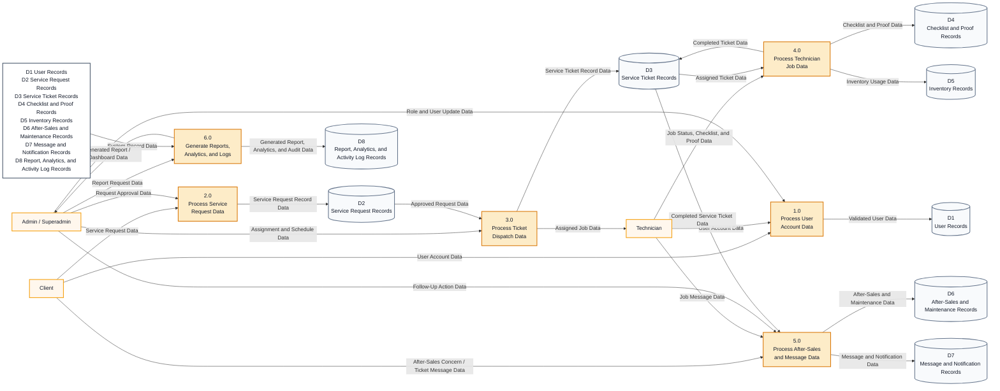

# Data Flow Diagram

## Where To Insert

Insert this after the **Use Case Diagram**. The use case diagram shows what users do, while the DFD shows how data moves through the system.

Suggested caption:

**Figure X. Data Flow Diagram of the Proposed AFN Service Management System**

## Diagram Tool

Use **Mermaid flowchart** for a clean Level 1 DFD-style diagram. This follows the reference structure: external actors on the left, numbered processes in the middle, and data stores on the right.

## Mermaid Code

Paste this exact code into Mermaid:

