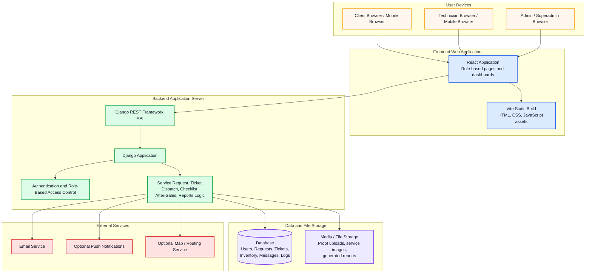

# Deployment Diagram

## Where To Insert

Insert this near the **Deployment Diagram** portion of Chapter III, similar to the reference Google Doc.

Suggested caption:

**Figure X. Deployment Diagram of the Proposed AFN Service Management System**

## Diagram Tool

Use **Mermaid flowchart**.

## Mermaid Code

Paste this exact code into Mermaid:

