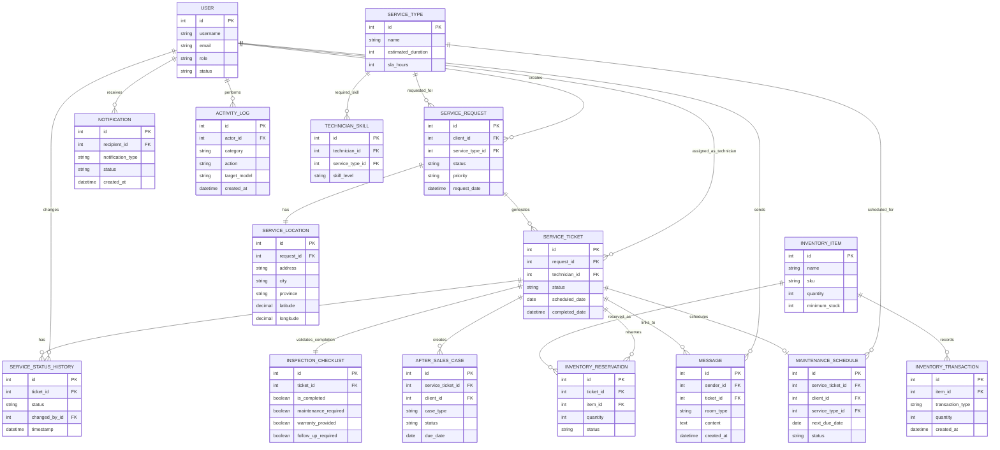

# Entity Relationship Diagram

## Where To Insert

Insert this after the **Data Flow Diagram**. The DFD shows data movement; the ERD shows how the main data is stored and connected in the database.

Suggested caption:

**Figure X. Entity Relationship Diagram of the Proposed AFN Service Management System**

## Diagram Tool

Use **Mermaid ER diagram**.

## Mermaid Code

Paste this exact code into Mermaid:

