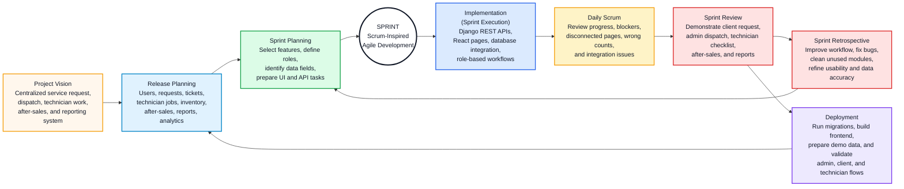

# Software Development Lifecycle Model

## Where To Insert

Insert this in the **Software Development Lifecycle** section of Chapter III, replacing the generic/reference model content with your system-specific content.

Suggested caption:

**Figure X. The Software Development Lifecycle of the Proposed AFN Service Management System**

## Diagram Tool

Use **Mermaid flowchart**. This follows the reference Google Doc's Scrum-inspired Agile model.

## Mermaid Code

Paste this exact code into Mermaid:

