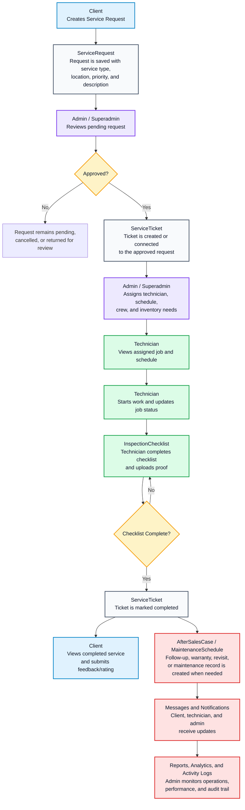

# System Workflow Model

## Where To Insert

Insert this after the **Requirements Analysis** section or before the detailed system diagrams. This model explains the main business flow of the system before showing use cases, DFD, ERD, and deployment.

Suggested caption:

**Figure X. System Workflow Model of the Proposed AFN Service Management System**

## Diagram Tool

Use **Mermaid flowchart**.

## Mermaid Code

Paste this exact code into Mermaid:

