# Use Case Diagram

## Where To Insert

Insert this after the **System Workflow Model**. The workflow shows the process, while this use case diagram shows what each user role can do.

Suggested caption:

**Figure X. Use Case Diagram of the Proposed AFN Service Management System**

## Diagram Tool

Use **Mermaid flowchart**. Mermaid does not have a native UML use case syntax that works everywhere, so this uses actors connected to use-case nodes.

## Mermaid Code

Paste this exact code into Mermaid:

```mermaid
flowchart LR
    Client["Client"]:::actor
    Technician["Technician"]:::actor
    Admin["Admin"]:::actor
    Superadmin["Superadmin"]:::actor

    subgraph System["AFN Service Management System"]
        UC1(("Register / Log In"))
        UC2(("Create Service Request"))
        UC3(("Track Request and Ticket Status"))
        UC4(("Request Reschedule"))
        UC5(("View Service History"))
        UC6(("Send Ticket-Linked After-Sales Message"))
        UC7(("Submit Rating and Feedback"))

        UC8(("View Assigned Jobs"))
        UC9(("View Technician Schedule"))
        UC10(("Update Job Status"))
        UC11(("Complete Checklist"))
        UC12(("Upload Proof of Work"))
        UC13(("Request Additional Equipment"))
        UC14(("View Job History"))

        UC15(("Manage Users and Roles"))
        UC16(("Approve Service Requests"))
        UC17(("Create and Assign Service Tickets"))
        UC18(("Monitor Dispatch Board"))
        UC19(("Manage Services and Inventory"))
        UC20(("Manage After-Sales Cases"))
        UC21(("View Reports and Analytics"))
        UC22(("View Activity Logs"))
        UC23(("Send and Receive Messages"))
        UC24(("Receive Notifications"))
    end

    Client --> UC1
    Client --> UC2
    Client --> UC3
    Client --> UC4
    Client --> UC5
    Client --> UC6
    Client --> UC7
    Client --> UC24

    Technician --> UC1
    Technician --> UC8
    Technician --> UC9
    Technician --> UC10
    Technician --> UC11
    Technician --> UC12
    Technician --> UC13
    Technician --> UC14
    Technician --> UC23
    Technician --> UC24

    Admin --> UC1
    Admin --> UC15
    Admin --> UC16
    Admin --> UC17
    Admin --> UC18
    Admin --> UC19
    Admin --> UC20
    Admin --> UC21
    Admin --> UC22
    Admin --> UC23
    Admin --> UC24

    Superadmin --> UC15
    Superadmin --> UC16
    Superadmin --> UC17
    Superadmin --> UC18
    Superadmin --> UC19
    Superadmin --> UC20
    Superadmin --> UC21
    Superadmin --> UC22
    Superadmin --> UC23

    classDef actor fill:#111827,stroke:#111827,stroke-width:2px,color:#ffffff
    classDef usecase fill:#f8fafc,stroke:#2563eb,stroke-width:2px,color:#0f172a
    class UC1,UC2,UC3,UC4,UC5,UC6,UC7,UC8,UC9,UC10,UC11,UC12,UC13,UC14,UC15,UC16,UC17,UC18,UC19,UC20,UC21,UC22,UC23,UC24 usecase
```

